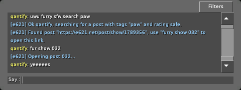

e621 Bot for Garry's Mod
===
>owo whats this? *evil grin*

Clone of the Reddit bot /u/furbot_ for your Garry's Mod server!
Enables players to search for furry content from [e621.net](https://e621.net/) in the game's chat.

Features
---
 * Super simple to use
 * Only 1 small server-side script needed
 * Almost perfect clone of the already loved /u/furbot_
 * Share your weird ass pron with your friends
 * *bruh moment when you realize what you are doing with your life*

Installation
---
There are 3 ways to install this addon, although I recommend using the [Steam Workshop](https://steamcommunity.com/sharedfiles/filedetails/?id=1681311957).

### Steam Workshop (recommended)
Simply head over to the [workshop page](https://steamcommunity.com/sharedfiles/filedetails/?id=1681311957) and click **Subscribe**.
The addon will download and install itself automatically.
It will also update automatically.

### Direct Install
Go to the [Releases](https://github.com/qantify/e621-grabber/releases) page and download the **.gma** file.
Put this file in your **GarrysMod/garrysmod/addons/** folder and restart the server/game.

### Legacy Addon Install
Go to the [Releases](https://github.com/qantify/e621-grabber/releases) page and download the **.zip** file.
Extract the zip into **GarrysMod/garrysmod/addons/**.
Once in-game, run `reload_legacy_addons` in the console and restart the server/game.

Usage
---
Once installed and enabled, the bot should be mostly ready to go.

**If you cannot search for explicit/questionable images, please see the `e621_allowunsafe` option under "Configuration"!**

Basic usage is pretty simple and you can talk to the bot in any chat message.
Examples:

`hey furbot search fox`:  
Search for explicit posts tagged 'fox'.

`fur safe paw`:  
Search for a safe post with paws in it.

`furry show s1c`:  
Open post ID 'S1C' in the in-game browser.

`e621 mild search handholding`:  
Find a post that isn't *too* explicit where two characters are holding hands.

It can usually also pick up commands when embedded within messages and when other text is present.
So you can be like:  
`oh hey furry show 82v thanks bud`  
and it will still show post 82V.

### Cues
The following words can be used to cue up the bot:

 * fur
 * furry
 * furbot
 * e621

Make sure to put a cue before your command!

### Commands
The bot supports the following commands:

##### *"sfw search"* <tags>
*Aliases: "swf search", "e926", "safe".*  
Search for an image rated "safe".

##### *"mild search"* <tags>
*Aliases: "questionable".*  
Search for an image rated "questionable".

##### *"search"* <tags>
*Aliases: "e621", "explicit", "explict".*  
Search for an image rated "explicit".

##### *"show"* <post id>
*Aliases: "view", "open".*  
Open a post in the in-game browser.
Uses provided post ID.

### Configuration
Configuration is done via console variables.

The following variables are available:

**e621_enabled (0/1, default 1)**  
Enable the bot?

**e621_allowunsafe (0/1, default 0)**  
Allow searching for explicit/questionable posts?

**e621_minscore (number, default 20)**  
Minimum post score. Posts below this score are not shown.

**e621_blacklist (tags separated by spaces)**  
Blacklisted tags, set to nothing to disable the blacklist.
The default blacklist is usually pretty good at keeping bad stuff at bay though.

Support
---
If you have any questions or encounter a bug, please comment on the [workshop page](https://steamcommunity.com/sharedfiles/filedetails/?id=1681311957) and I will get back to you as soon as I can.

Alternatively, create a discussion on the [workshop](https://steamcommunity.com/sharedfiles/filedetails/?id=1681311957) and then link it in the comments if it becomes too big for the comment section.

If you have an issue with addon compatibility, a quick workaround is to run `e621_forceenable` as a command in the console.
This will remove all other PlayerSay hooks, but might break other addons.

Authors
---
Made with ❤ by qantify.
Find me online at /u/qantify and \@qantify.

License
---
Licensed under [MIT](LICENSE). (although I really don't give a shit, do whatever you want with it)

&nbsp;  
&nbsp;  
&nbsp;  
&nbsp;  
&nbsp;  
&nbsp;  
*i cant believe that i spent days making this*
